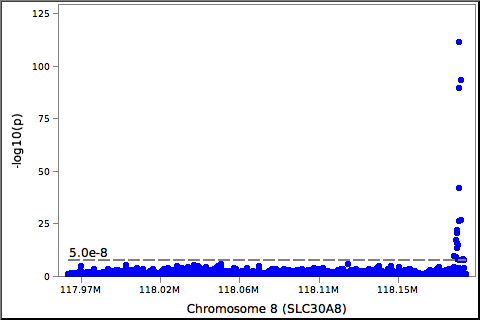
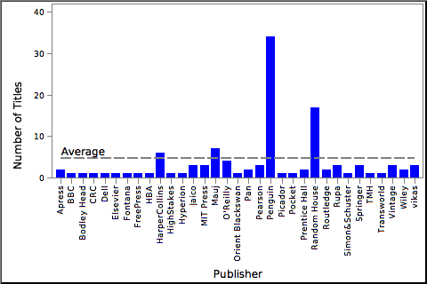

# DataFrames for Squeak

This is a simple - but efficient - DataFrames implementation for Squeak, which also contains code for CSV reading/writing and plotting.

It's still in the early stages, but is already quite capable. It makes heavy reuse of streams to limit memory allocations, is column-major for performance, Series, and a KeyIndex class used for creating primary and secondary indexes (B-Trees).

While not as extensive as Pandas, it is on-par performance wise with many Pandas operations and only slighly slower in others. There are a couple areas where it is much slower (most notably on data loading/writing) and others where it is notably faster due to implementation decisions made on what not to support.

## Installing

Use Monticello from within a Workspace:

```smalltalk
Moticello new
    baseline: 'DataFrames';
    repository: 'github://massung/squeak-dataframes:main/src';
    load.
```

## Examples

Below are some simple examples of use along with performance numbers on my home machine.

### Loading Genetic Data from a REST API

This first examples loads variant associations for Type 1 Diabetes for the gene IL2RA and plots them with a scatter plot. Some points to highlight:

* loading of "records" (dictionaries)
* there were 3,394 records loaded in 19 ms
* access to column/series data (#at:) and create new columns: (#at:put:)
* formatting and labeling of figure axes
* adding multiple plots on top of each other

```smalltalk
r := WebClient httpGet: 'https://bioindex.hugeamp.org/api/bio/query/associations?q=t2d,slc30a8'.

"load a dataframe from records: a list of dictionaries"
df := DataFrame withRecords: ((STON fromString: r content) at: 'data').

"add a column to the dataframe computed from another"
df at: #log10p put: ((df at: #pValue) collect: [:x | x log negated]).

"scatter plot the associations"
fig := Figure new dataFrame: df.
fig width: 480; height: 320.

"setup the x axis"
fig x column: #position; label: 'Chromosome 8 (SLC30A8)'.
fig x tickFormat: [:x | ((x / 1000000) printShowingDecimalPlaces: 2) , 'M'].

"setup the y axis"
fig y column: #log10p; label: '-log10(p)'.
fig y tickFormat: [:x | x floor].

"add plots"
(fig addPlot: ScatterPlot) size: 3.
(fig addPlot: HLinePlot) value: 5e-8 log negated; label: 5e-8.

"show it"
fig openInWorld.
```



## Grouping and Aggregating

This example loads a small (~20k) CSV file that lists books by title, author, genre, publisher, etc. It then combines the publisher and author columns together into a new column, counts how many books were published by each, and then plots it as a bar chart. Key highlights:

* CSV files can be read and written using a CSV dialect
* frame methods are immutable - new frames are returned at each step
* building of new frames from existing ones is cheap and fast
* grouping and aggregating is done by Series
* nil values are automatically excluded from results by default
* vertical tick labels

```smalltalk
df := DataFrame fromCsv: CsvDialect default fileNamed: 'books.csv'.

"create a new frame, selecting columns and aggregating by key"
counts := (df cut: #(Publisher Title)) reduce: [:series | series size] groupedBy: #Publisher.

"build and show the plot"
fig := Figure new dataFrame: counts.

"setup axes"
fig x column: #Publisher; tickRotation: -90.
fig y column: #Title; label: 'Number of Titles'; from: 0.

"add plots"
(fig addPlot: BarPlot).
(fig addPlot: HLinePlot) value: (fig y series mean); label: 'Average'.

"show"
fig openInWorld.
```



### Features Not Shown

Additional features that already exist...

* `printOn:` outputs the frame in CSV format for inspecting
* reading/writing JSON-lines format
* initializing using column- or row-major data
* appending to an existing frame using column- or row-major data
* renaming and/or dropping columns
* dropping duplicates records by column value
* reversing the primary index of a frame
* streaming rows (arrays) and records (dictionaries)
* joining dataframes: inner, left outer, and right outer
* sorting by column ascending, descending, and custom
* unioning frames together (including columns)
* selecting/filtering rows by series
* scanning by secondary index
* ranking
* min, max, mean, median, and mode functions for secondary indexes
* series (column) doing, collecting, and selecting
* series operations with scalars, collections, or other series
* in-place updating of series data

Some quick examples of the above:

```smalltalk
"who is the the most prolific author in our list?"
(df secondaryIndex: #Author) mode

"remove any records with missing fields"
df dropNA

"how many significant coding variants are in the gene?"
df select: ((df at: #pValue) <= 0.05 and: (df at: #consequence) = 'missense_variant')

"stream and collect records of variant with p-value between a range"
(df scan: #pValue from: 5e-8 to: 0.05) collect: [:index | df recordAt: index]
```

And more will be added here as I have time...
